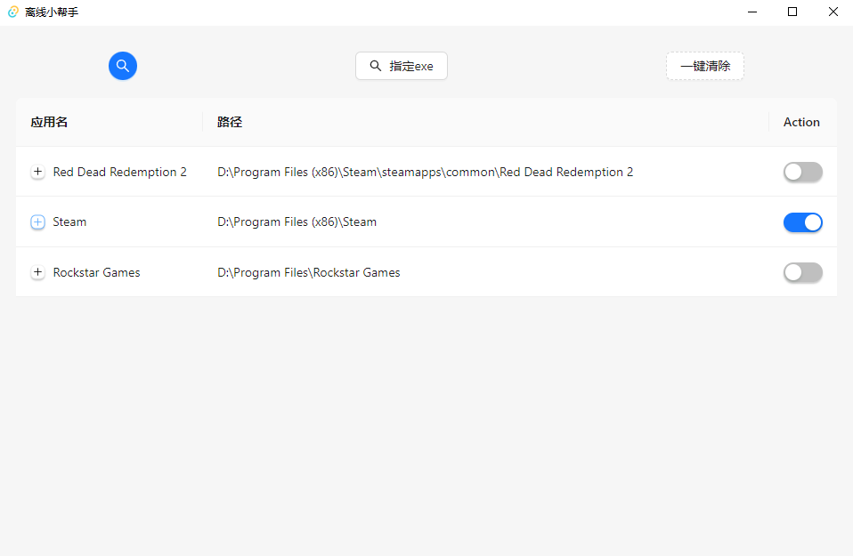

# 离线小帮手
Tauri + Vue 3 + TypeScript

### 简单介绍
使用rust编写，适用于windows，联网控制软件，使应用软件离线

需要以管理员身份运行此软件

所用技术有tokio多线程，异步，已尽量优化~~

1. 选择软件进行联网控制，主要为 _**断网**_ 功能
2. 选择文件夹，该文件夹下的所有软件都进行联网控制
3. 清空所选的软件

win10已通过测试

### 环境
需要安装win下的rust环境，参考
https://www.rust-lang.org/zh-CN/tools/install

nodejs
https://nodejs.org/en/download/

开发环境
`npm run tauri dev`

正式环境
`npm run tauri build`

### 界面

